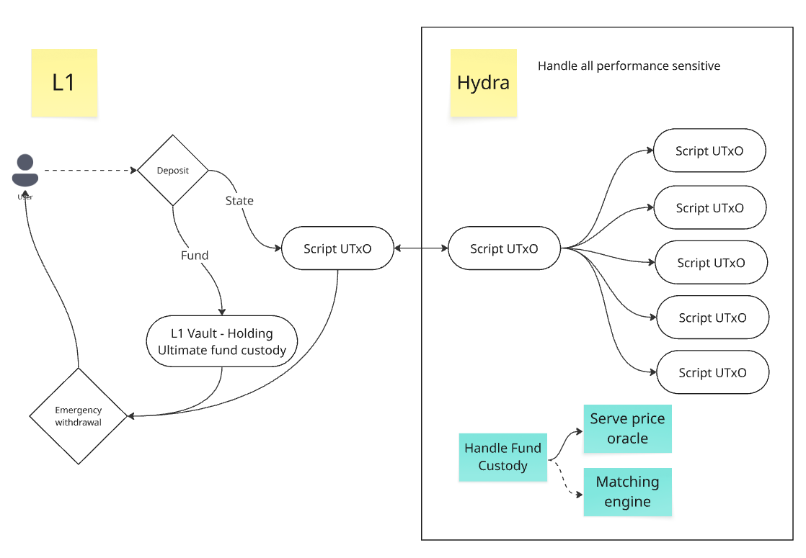

# How DeltaDeFi Uses Hydra

DeltaDeFi's main product story is to serve high frequency trading users:

1. Sub-second order placement confirmation
2. Zero cost place / cancel orders
3. API trading

While achieving above, DeltaDeFi designs with a goal to ultimately becomes fully decentralized.

| | Sub-second confirmation | Zero cost place/cancel | API trading | Fully decentralized |
|---|---|---|---|---|
| **L1 App (V1)** | No | Yes (with hacks) | Yes | Restricted if retaining UX |
| **Pure DB** | Yes | Yes | Yes | No |
| **Hydra** | Yes | Yes | Yes | Yes |

## How DeltaDeFi Uses Hydra

### Merkle Tree Compression
- Application data is compressed into Merkle trees when committing/decommitting UTxOs to and from Hydra
- Solves the scalability problem: transferring complete app state between L1 and L2 would be impractical with a large user base
- All necessary information is encoded into a single Merkle root hash, making the system indefinitely scalable

### How Trading Works Inside Hydra
- Once UTxOs are committed to Hydra, large transactions break down into distinct UTxOs
- The exchange operates like a traditional L1 order book DEX, but inside Hydra
- Transactions within Hydra incur exactly zero cost — execution units and transaction fee limitations are relaxed

### Performance
- Expensive operations are deferred to Hydra where computational constraints disappear
- L1 deposits and withdrawals still follow standard Cardano transaction rules and are processed sequentially to update the affected Merkle root

### Data Integrity & Transparency
- To mitigate fund-locking risks from losing Merkle tree records, DeltaDeFi publicly maintains the entire Merkle tree operation record
- Ensures transparency and enables recovery if neededa

### How we are not using it as "designed"

- Unclosable states all the time
- Federated trust mechanism

## What we would like to see on roadmap

1. Reliablility (less care needed to use)
2. Scalability (memory & latency)
3. Inter-op with other chains (midnight, bitcoin)
